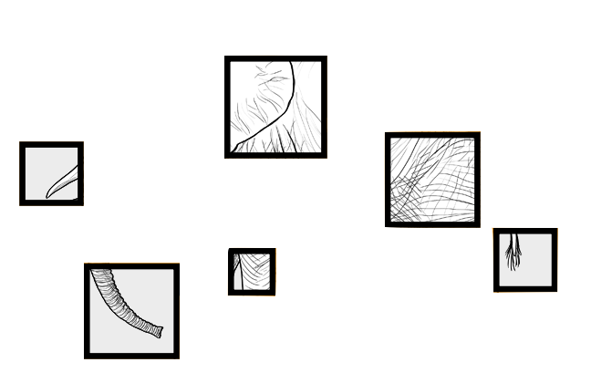

 
 
 

_"Whether we are speaking of this sea plant or an oak tree, of an ape or a man, we will do well to recognize that life is an active process, not a passive one. Whether the stimulus arises from within or without, whether the environment is favorable or unfavorable, the behaviors of an organism can be counted on to be in the direction of maintaining, enhancing, and reproducing itself._
 
 
_This is the very nature of the process we call life."_

-Rogers (1963, p. 3)

&nbsp;

A work by <a href="www.ugent.be/dodentocht">Joachim Waterschoot</a>

<em>Joachim.Waterschoot@ugent.be</em>

<!-- Add icon library -->
<link rel="stylesheet" href="https://cdnjs.cloudflare.com/ajax/libs/font-awesome/4.7.0/css/font-awesome.min.css">

<!-- Add font awesome icons -->

    
    
    

&nbsp;

